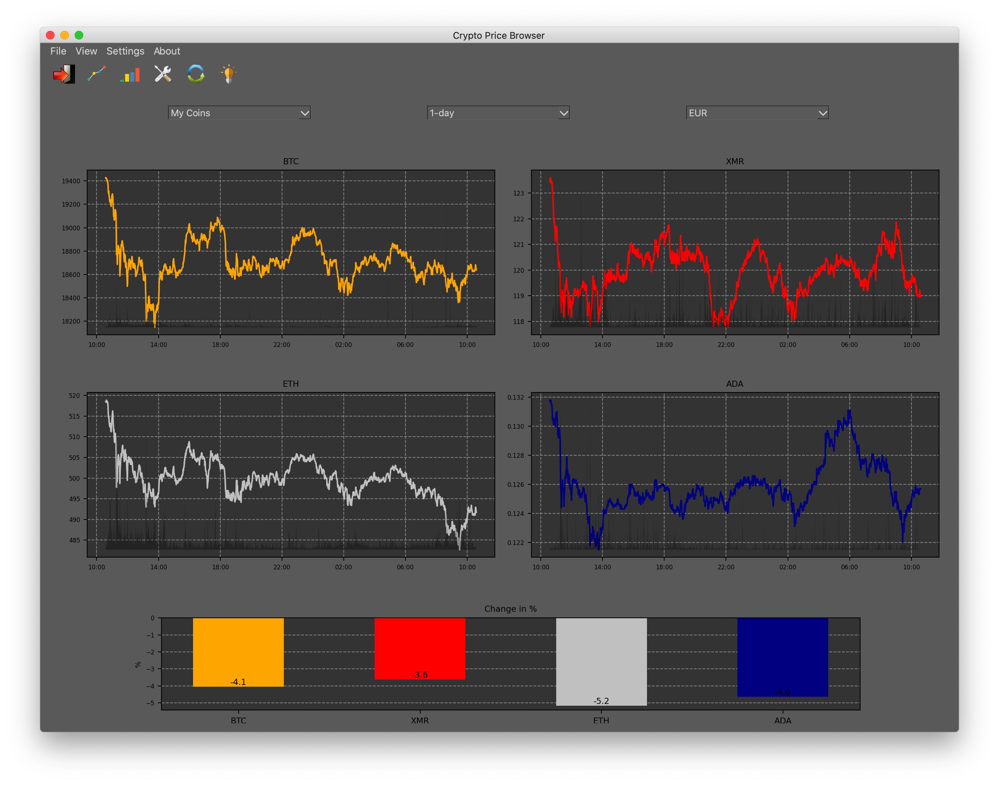

# Crypto-Price-Navigator

**Description:**

Cryptocurrency Price Data GUI written in Python3 with PyQt5 and matplotlib.
Retrieves prices from the CryptoCompare API: https://min-api.cryptocompare.com/ and displays them in different graphical and numerical ways.
 
**Screenshots:**

**Features and challenges:**
- Matplotlib styling and rendering
- Dark / Light Mode
- PyQt layout management
- Editor Mode for data customization

**Dependencies:**
- requests 
- PyQt5
- matplotlib
- numpy

 
**TO-DO:**

*Avoid Duplications in:* 
- config files: unify one file
- color definitions: unify, pass as parameter
- 
